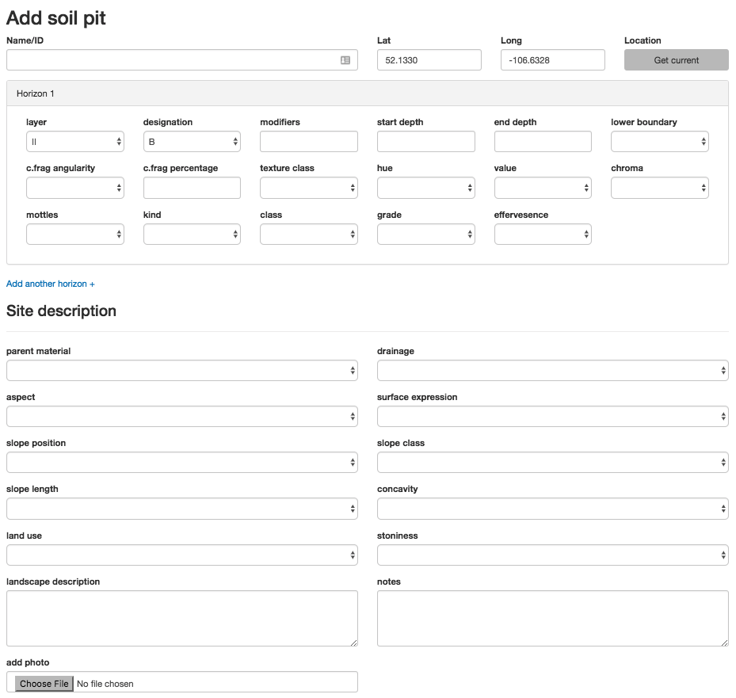

# Angular 2 soil input form

An Angular2 component that allows one to insert a soil pit entry form into a project. This is highly influenced by the soil data sheets that we use here in Western Canada, but I suspect it would be a solid starting point for any soil pit data collection needs. 

The project is part of the larger Saskatchewan Soil Information Systemn (SKSIS- link to come).

 

